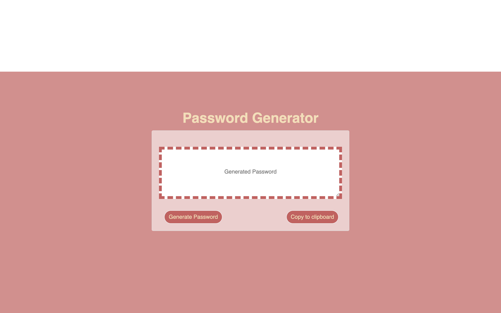

## Password Generator

## Description

_Password Generator_ is a web-based, responsive, application that generates a password based on user criteria. Before the password is generated, user input is validated to ensure character minimums and types.

## Where to find

View the deployed project at https://jessmaple.github.io/passwordGen/

## Usage

1. Click 'generate password'
2. Follow validation prompts.
3. Receive new password.
4. (Optional) click 'copy to keyboard'
